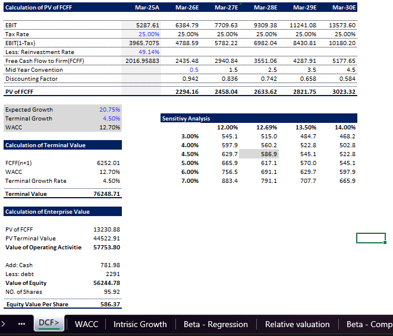

# Asian Paints — DCF & Equity Valuation

A financial valuation model for **Asian Paints Ltd.** combining Discounted Cash Flow (DCF), WACC, comparable-company valuation, beta analysis, intrinsic growth analysis, and supporting financial-statement analysis.

## Project Overview

This project evaluates Asian Paints using multiple valuation approaches to estimate its intrinsic value and compare it with the market price.

### Valuation Methods

- Discounted Cash Flow (DCF)
- Weighted Average Cost of Capital (WACC)
- Comparable Company Analysis
- EV/Revenue valuation
- EV/EBITDA valuation
- P/E valuation
- Football Field valuation
- Beta analysis
- Intrinsic growth analysis

### Financial Analysis

The model also includes:

- Historical financial statements
- Profitability analysis
- ROE and ROA
- DuPont analysis
- ROIC
- Reinvestment rate
- Altman Z-Score
- Value at Risk (VaR)

## Key Model Outputs

| Metric | Model Output |
|---|---:|
| Current Share Price | ₹2,605.60 |
| DCF Value / Share | ₹586.37 |
| WACC | 12.70% |
| Expected Growth | 20.75% |
| Terminal Growth | 4.50% |
| EV/Revenue Value / Share | ₹1,393.85 |
| EV/EBITDA Value / Share | ₹1,797.10 |
| P/E Value / Share | ₹1,545.35 |

## DCF Methodology

The DCF model estimates:

1. EBIT
2. EBIT after tax
3. Reinvestment
4. Free Cash Flow to Firm (FCFF)
5. Present value of forecast FCFF
6. Terminal value
7. Enterprise value
8. Equity value
9. Implied value per share

## WACC

The WACC analysis incorporates:

- Risk-free rate
- Equity risk premium
- Levered beta
- Comparable-company beta
- Cost of equity
- Cost of debt
- Capital structure

## Key Conclusion

Based on the assumptions used in the model, the intrinsic values produced by the DCF and comparable-company approaches are below the market price used in the analysis.

This suggests that **Asian Paints is trading at a premium to the valuation implied by the model assumptions**.

The valuation is highly sensitive to assumptions such as growth, WACC, terminal growth, margins, and reinvestment.

## Tools & Skills Demonstrated

**Financial Modeling · DCF · WACC · Comparable Company Analysis · Equity Valuation · Excel · Financial Statement Analysis · Risk Analysis**

## Data Sources

The workbook identifies **Screener.in** and **The Valuation School** as sources for parts of the valuation and comparable-company analysis.

Market and financial inputs should be independently verified before using the model for investment decisions.

## Disclaimer

This project is created for **educational and portfolio purposes only**. It is not investment advice or a recommendation to buy or sell any security.

## Valuation Analysis Screenshots

### DuPont Analysis

### DCF Valuation

### Football Field Analysis

### Relative Valuation

